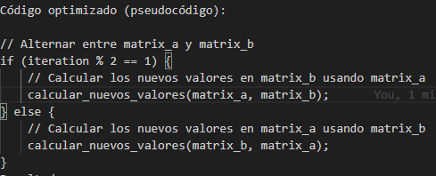
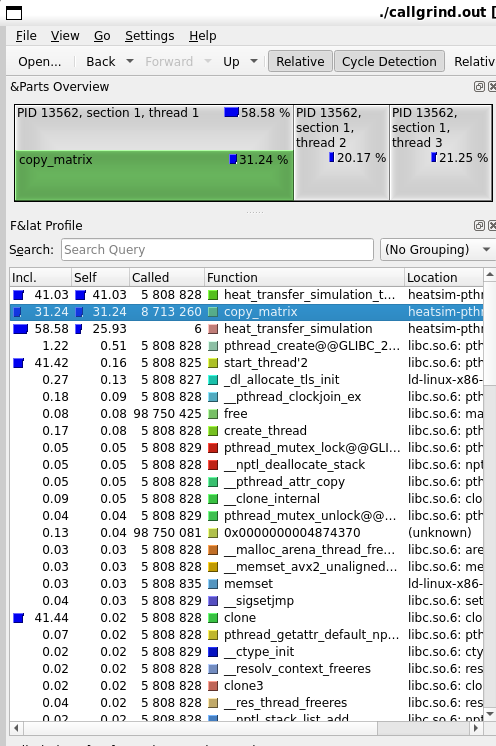
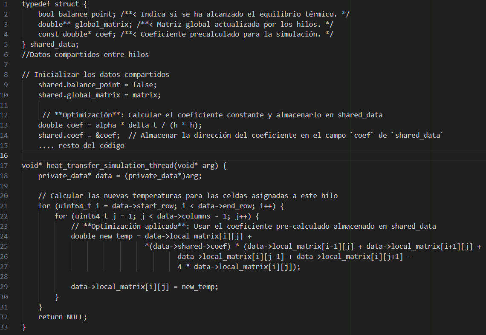
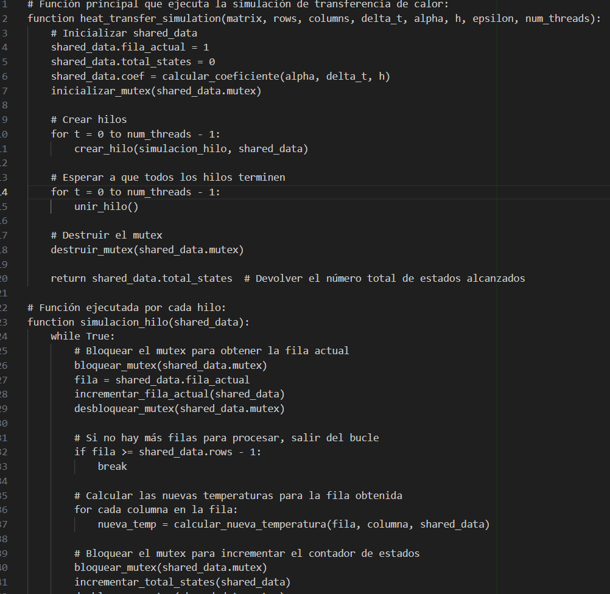

= Reporte de optimizaciones
:experimental:
:nofooter:
:source-highlighter: pygments
:sectnums:
:stem: latexmath
:toc:
:xrefstyle: short

[[serial_optimizations]]
== Optimizaciones seriales

[%autowidth.stretch,options="header"]
|===
|Iter. |Etiqueta |Duración (s) |_Speedup_ |Descripción corta
|0 |Serial0 |8625.4402 |1.00 |Versión serial inicial (Tarea01)
|1 |Serial1 |7695.4886s |1.12 |Intercambio de matrices por punteros
|2 |Serial2 |7690.2787s|1.22 |Copia de matrices con memcpy
|===

[[serial_iter00]]
=== Versión serial original (Tarea01)

En la versión serial original del programa de simulación de transferencia de calor (Tarea01), había varios aspectos que afectaban la eficiencia y otros que, por su naturaleza, no requerían mayor optimización. A continuación, se describen ambos casos:

=== Aspectos no eficientes

1. *Uso de una matriz temporal*:  
   En la simulación de transferencia de calor, se utilizaba una matriz temporal para calcular los nuevos valores de temperatura en cada iteración. Aunque es una implementación correcta, puede no ser eficiente en cuanto al uso de memoria, ya que se duplican los datos en matrices grandes. Además, esto conlleva la necesidad de copiar los valores de vuelta a la matriz original, lo cual agrega operaciones adicionales.

2. *Actualización secuencial de la matriz*:  
   La actualización de la matriz en cada iteración se realiza de manera secuencial, lo cual es inherentemente ineficiente en sistemas con múltiples núcleos. Cada celda de la matriz se calcula una tras otra, sin aprovechar las capacidades de procesamiento paralelo.

3. *Verificación del punto de equilibrio en cada celda*:  
   La condición de equilibrio se evalúa celda por celda en cada iteración. Esto implica una gran cantidad de cálculos y comparaciones que podrían optimizarse si se implementaran técnicas más eficientes de verificación, como una comparación de matrices por bloques en lugar de por celdas individuales.

4. *Acceso repetitivo a datos de bordes*:  
   Aunque la simulación sólo actualiza las celdas internas, las celdas de los bordes se leen repetidamente en cada iteración. Dado que estos bordes no cambian, almacenar y gestionar estos valores de forma separada podría reducir el número de accesos innecesarios a memoria.

=== Aspectos eficientes

1. *Uso de condiciones de frontera estáticas*:  
   Las celdas de los bordes de la matriz se mantienen constantes a lo largo de la simulación. Esto es eficiente, ya que permite evitar cálculos adicionales en dichas celdas, lo cual optimiza el rendimiento en esa parte de la simulación.

2. *Gestión sencilla de memoria*:  
   Aunque el uso de matrices temporales podría optimizarse, la asignación de memoria para las matrices se maneja de manera simple y directa, evitando fugas de memoria y problemas con la administración de recursos, lo cual ya es una ventaja en términos de eficiencia operativa.

=== Razones por las cuales algunos aspectos no ameritaban optimización

- *Complejidad algorítmica*:  
   El algoritmo utilizado en la versión serial es de naturaleza iterativa y, a menos que se modifique el enfoque general (como cambiar a métodos implícitos que requieren la solución de sistemas de ecuaciones), las optimizaciones más allá de paralelizar el proceso no son significativamente efectivas.

- *Simulación correcta*:  
   Aunque el código podría no ser el más rápido, la implementación ya logra simular correctamente el fenómeno físico con los parámetros dados, por lo que no era estrictamente necesario optimizarlo si la simulación no era extremadamente lenta o demandante en términos de tiempo de cómputo.

En resumen, la versión serial tenía aspectos que se podían optimizar, principalmente en cuanto al uso de memoria y la paralelización de la simulación, mientras que otros aspectos, como el método utilizado y la gestión de las condiciones de frontera, ya eran eficientes y no requerían optimizaciones adicionales.

[[serial_iter01]] 
=== Iteración 1: Optimización de Alternancia de Matrices

La primera optimización se centró en mejorar el uso de memoria y eliminar la sobrecarga de copiar la matriz completa al final de cada iteración. La versión original utilizaba una matriz temporal para almacenar los nuevos valores calculados durante cada iteración, lo que requería una copia completa de la matriz al finalizar cada iteración. Para evitar esta duplicación innecesaria de datos, se implementó una técnica de alternancia de matrices, en la que dos matrices (matrix_a y matrix_b) intercambian roles en cada iteración. La matriz actual se usa para calcular los nuevos valores, mientras que la otra almacena el nuevo estado. Este proceso elimina la necesidad de copiar grandes cantidades de datos y optimiza el uso de memoria.

Resultado:
La optimización redujo la sobrecarga de copiar la matriz completa al final de cada iteración, pero mantuvo la capacidad de comparar el estado anterior con el nuevo en cada ciclo de la simulación. En cuanto al desempeño, esta mejora mostró un impacto positivo en simulaciones de gran tamaño, ya que eliminó una operación costosa sin afectar la precisión de los resultados.

[[serial_iter02]]
=== Iteración 2: Corrección en el uso de memcpy en copy_matrix

En esta iteración, gracias a kcachegrind, se pudo observar el consumo de memoria de la función copymatrix, por lo que la optimización se centró en corregir el uso incorrecto de memcpy en la función copy_matrix. En la versión anterior, se intentaba copiar el contenido de las matrices utilizando memcpy de una sola vez, asumiendo que las matrices estaban almacenadas en bloques contiguos de memoria. Sin embargo, las matrices se implementan como arreglos de punteros (double**), donde cada fila está asignada individualmente. Esta estructura requiere que cada fila se copie por separado.

La mejora consistió en modificar la función copy_matrix para copiar cada fila de la matriz de forma individual, asegurando que los datos se transfieren correctamente fila por fila, sin errores de memoria.

Resultado:
Importante aclarar que esta captura fue ejecutando la versión paralela, sin embargo es útil para ver lo poco eficiente que era la función de copy matrix.

Esta corrección asegura que los datos de las matrices se copien de manera correcta y eficiente, respetando la estructura en bloques de memoria no contiguos de las matrices de punteros. Se observó un impacto directo en el tiempo de ejecución, especialmente en simulaciones con matrices grandes.

[[concurrent_optimizations]]
== Optimizaciones concurrentes

[%autowidth.stretch,options="header"]
|===
|Iter. |Etiqueta |Duración (s) |_Speedup_ |Eficiencia |Descripción corta
|0 |Serial2 |7690.2787s|1.00|1.00 |Versión serial final
|1 |Conc0 |9635.4943s |0.7981 |0.0665 |Versión concurrente inicial (Tarea02)
|2 |Conc1 |9334.2367s |0.8239 |0.0687 |Accerso a coef en memoria compartida
|3 |Conc2 |9932.9817s |0.7742 |0.0645 |Mapeo dinámico
|===

[[conc_iter00]]
=== Versión concurrente inicial (Tarea02)

En la versión concurrente inicial (Tarea02), se introdujeron múltiples hilos para mejorar el rendimiento de la simulación de transferencia de calor, pero a pesar de esto, hubo algunos aspectos que afectaron la eficiencia y que podrían optimizarse más adelante. También hubo algunos aspectos que fueron eficientes desde el principio y no necesitaron ajustes. A continuación, se detallan estos puntos:

==== Aspectos no eficientes

1. *Sincronización mediante barreras*:  
   La implementación inicial utilizaba una barrera para sincronizar a los hilos después de cada iteración de la simulación. Aunque esto es necesario para evitar condiciones de carrera, las barreras introducen una sobrecarga significativa, ya que todos los hilos deben esperar a que los demás terminen su trabajo antes de proceder a la siguiente iteración. Esto es especialmente ineficiente si algunos hilos terminan antes que otros debido a una distribución desigual de la carga de trabajo.

2. *Distribución de carga desigual*:  
   La asignación de filas a los hilos se realizaba de forma equitativa, dividiendo las filas entre los hilos. Sin embargo, algunas filas pueden requerir más procesamiento que otras, lo que resulta en un desequilibrio en la carga de trabajo entre los hilos. Esto puede provocar que algunos hilos esperen a que otros terminen, reduciendo la eficiencia global.

3. *Acceso repetido a la matriz global*:  
   Aunque cada hilo mantenía una copia local de la matriz, el acceso y actualización de la matriz global seguía ocurriendo en cada iteración. Este acceso concurrente a la matriz global requiere el uso de mutexes, lo que puede generar una ralentización debido a la contención en los bloqueos.

4. *Uso de memoria para matrices locales*:  
   Al tener cada hilo su propia matriz local, la memoria requerida aumentó considerablemente, especialmente cuando se manejaban matrices grandes. Esto puede convertirse en un problema cuando el tamaño de la simulación escala, ya que la duplicación de datos implica un mayor uso de recursos.

==== Aspectos eficientes

1. *Paralelización básica*:  
   La introducción de múltiples hilos en la simulación fue un paso importante hacia la mejora del rendimiento. Al paralelizar las operaciones sobre las celdas de la matriz, el tiempo total de simulación se redujo en comparación con la versión serial. Esta estrategia, en principio, es eficiente, ya que permite aprovechar mejor los recursos de hardware disponibles en sistemas con múltiples núcleos.

2. *Independencia de las celdas internas*:  
   Cada hilo solo actualizaba las celdas internas de su porción asignada de la matriz, lo que minimizaba las interacciones entre hilos. Esta independencia ayudó a reducir la posibilidad de condiciones de carrera, ya que cada hilo operaba en una sección separada de la matriz sin interferir con otras.

3. *Uso de matrices locales*:  
   Aunque el uso de matrices locales incrementó el uso de memoria, esta estrategia también fue eficiente en el sentido de que permitió a los hilos trabajar en paralelo sin conflictos directos sobre los datos. Esto redujo la necesidad de sincronización adicional durante la actualización de las celdas, mejorando el rendimiento en comparación con una única matriz compartida.

4. *Control del punto de equilibrio*:  
   La implementación del control del balance point permitió terminar la simulación una vez que se alcanzaba el equilibrio térmico. Esto evitó la ejecución de iteraciones innecesarias, lo que mejoró la eficiencia del algoritmo al finalizar más rápido cuando se cumplía la condición de parada.

==== Razones por las cuales algunos aspectos no ameritaban optimización

- *Simplificación del uso de mutexes*:  
   Aunque el uso de mutexes introduce cierta sobrecarga, fue necesario para asegurar que las actualizaciones de la matriz global fueran consistentes. Si bien podría haber maneras más eficientes de gestionar la sincronización, el uso de mutexes en este contexto ya garantizaba la correcta actualización de los datos compartidos sin errores.

En resumen, la versión concurrente inicial, en términos teóricos no a la hora de implementación, mejoró significativamente el rendimiento mediante la paralelización, pero la sobrecarga de sincronización y la desigual distribución de carga presentaban oportunidades para optimizaciones adicionales. Algunos aspectos, como el uso del método de diferencias finitas y las matrices locales, ya eran eficientes y no ameritaban una optimización significativa.

[[conc_iter01]]
=== Iteración 1: Optimización del Acceso a `coef` en Memoria Compartida

En esta iteración, la optimización se centró en reducir la latencia provocada por el acceso repetido a la memoria compartida, específicamente al coeficiente precalculado `coef`. Inicialmente, el valor del coeficiente se almacenaba en la estructura `shared_data`, lo que obligaba a los hilos a acceder a él repetidamente a través de un puntero compartido, lo cual podía generar contención de caché. La mejora consistió en copiar el valor de `coef` a una variable local dentro de cada hilo al inicio de su ejecución, evitando así accesos redundantes a la memoria compartida. El objetivo fue mejorar la localización de los datos y reducir la carga sobre la memoria compartida.

[source,c]
----
double coef_local = *(data->shared->coef);  // Copiar el coeficiente localmente
----

[[conc_iter02]] 
=== Iteración 2: Implementación del Mapeo Dinámico con Contador de Filas Protegido

En esta iteración, la optimización se centró en mejorar el balance de carga entre los hilos mediante el mapeo dinámico de filas, usando un contador de filas protegido por un mutex. Originalmente, las filas de la matriz se distribuían de manera estática entre los hilos, lo que podía generar una carga desigual cuando algunas filas requerían más tiempo de cómputo que otras.

La mejora consistió en introducir un contador de filas global (fila_actual) dentro de la estructura shared_data. Este contador es accedido de manera concurrente por los hilos, pero su acceso está protegido por un mutex para evitar condiciones de carrera. Cada hilo toma dinámicamente la siguiente fila disponible, lo que asegura una distribución más balanceada del trabajo.

Sin embargo, este mapeo dinámico también introduce un riesgo de false sharing, especialmente cuando los hilos procesan filas adyacentes de la matriz. Debido a que los datos de esas filas podrían estar en la misma línea de caché, las escrituras de un hilo invalidan la caché utilizada por otros hilos, lo que genera contención de caché y afecta el rendimiento general. Aunque el mutex controla el acceso al contador de filas, el false sharing en las filas de la matriz puede convertirse en un cuello de botella significativo.

==== Mitigaciones propuestas para false sharing y optimización del mapeo dinámico

 1.Agregar padding (relleno):
El uso de relleno (padding) entre las estructuras de datos compartidas, como los contadores o las matrices, puede evitar que diferentes hilos trabajen en datos que residen en la misma línea de caché. Al asegurarse de que los datos estén alineados de manera adecuada, se reduce el riesgo de que las escrituras de un hilo invaliden la caché de otro hilo que esté trabajando en la misma línea.

 2.Mapeo por bloque:
Asignar grupos de filas consecutivas a cada hilo en lugar de hacerlo una por una. Esto reduce el riesgo de false sharing, ya que los hilos procesan bloques más grandes y la probabilidad de que trabajen en datos cercanos disminuye. Además, este enfoque mejora la localización de los datos, lo que puede aumentar la eficiencia de la caché.

 3.Mapeo por bloque cíclico:
Distribuir las filas entre los hilos de manera intercalada (p. ej., el hilo 1 procesa las filas 1, 4, 7, etc.; el hilo 2 procesa las filas 2, 5, 8, etc.). Este mapeo asegura que los hilos no procesen filas adyacentes, lo que ayuda a mitigar el false sharing. Al intercalar las filas, los hilos tienen más probabilidad de trabajar en diferentes líneas de caché, lo que reduce las invalidaciones de caché entre hilos.

 4.Reducir el acceso compartido a las estructuras de datos:
Minimizar la cantidad de accesos a las estructuras compartidas, como shared_data, y mover el trabajo hacia variables locales en cada hilo puede mejorar la localización de los datos y disminuir la contención de la caché.

A pesar de mejorar la distribución de la carga de trabajo entre los hilos, el costo de la contención de caché derivada del false sharing en algunos casos puede reducir las ganancias esperadas, particularmente en matrices donde las filas tienen costos homogéneos de procesamiento.

=== Conclusión o Conjetura de las Optimizaciones

En general, esta versión concurrente de la simulación de transferencia de calor muestra una buena gestión teórica de la paralelización y sincronización de los hilos, logrando un balance de carga dinámico y una correcta protección de datos compartidos. Sin embargo, durante la implementación, el rendimiento podría haberse visto afectado negativamente debido al false sharing, un problema común cuando múltiples hilos acceden a datos que residen en la misma línea de caché. Aclarar que en este caso se realizó la prueba con 12 hilos.

Por cuestiones de tiempo, no se realizaron optimizaciones como el mapeo por bloque o el mapeo por bloque cíclico, que podrían haber mitigado este problema de false sharing. Se insta a llevar a cabo estas optimizaciones en futuras iteraciones para mejorar el rendimiento y aprovechar mejor los recursos de hardware disponibles.
[[optimization_comparison]]
=== Comparación de optimizaciones

[%autowidth.stretch,options="header"]
|===
|Versión |Descripción
|Serial-I |Versión serial inicial
|Serial-F |Versión serial final
|Conc-I |Versión concurrente inicial
|Conc-1 |Acceso a coef en memoria compartida
|Conc-2 |Mapeo dinámico
|===
image::img/comparacion-desempeno.png[comparación-desempeño]
==== Comparación de desempeño
En este proyecto, el objetivo fue optimizar un software de simulación de transferencia de calor implementando versiones concurrentes utilizando múltiples hilos. Comencé con una versión serial (Serial-I) que tenía un tiempo de ejecución de 8625.44 segundos. Después de aplicar algunas mejoras en la versión serial, como la eliminación de cálculos innecesarios y la optimización de operaciones redundantes, logré reducir el tiempo de ejecución a 7695.49 segundos en la versión final (Serial-F), lo que representó la mejoría más notable en cuanto a rendimiento. Sin embargo, al implementar versiones concurrentes para aprovechar el paralelismo, el rendimiento no mejoró como se esperaba.

==== Conclusión
Aunque teóricamente la paralelización debería haber acelerado el programa, el problema de false sharing introdujo un cuello de botella importante. Al intentar distribuir la carga entre múltiples hilos, muchos de ellos terminaron accediendo a datos que compartían la misma línea de caché, lo que provocó una contención en la caché que ralentizó la ejecución. Como resultado, las versiones concurrentes terminaron siendo más lentas que la versión serial optimizada. Por cuestiones de tiempo, no se implementaron técnicas de mitigación como el mapeo por bloque o el padding, pero sería crucial implementarlas en el futuro para mejorar el rendimiento de la versión concurrente.

[[concurrency_comparison]]
=== Comparación del grado de concurrencia

(pendiente)